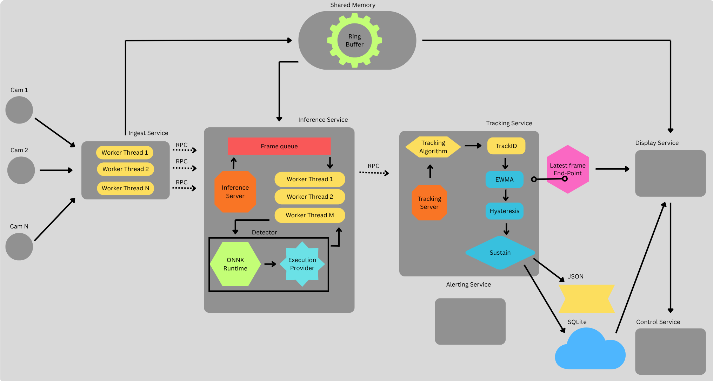

# Theft Detection System

Real-time edge video analytics for retail shoplifting detection. Frames flow from RTSP cameras
through ingest, ONNX/YOLOv8 inference, ByteTrack tracking and an EWMA suspicion engine, ending in
alerts and a live browser dashboard — all on one box, with no cloud hop.

The C++ services (ingest, inference) are the hot data path. The Python services (tracking, event,
display, control) handle tracking, alerting, the UI and fleet lifecycle.

---

## Architecture



Cameras land on **ingest**, which decodes RTSP and publishes raw BGR frames into a **shared-memory
ring buffer**, sending only a lightweight reference over gRPC. **Inference** pops those references
from a bounded frame queue, fetches the pixels from the ring, and runs YOLOv8 through ONNX Runtime
on a pool of worker threads sharing one session. Detections are pushed forward over gRPC to
**tracking**, which assigns track IDs, feeds a per-track EWMA suspicion score through hysteresis and
a sustain window, and emits alerts to JSON and SQLite. **Display** reads frames straight from the
ring and detections from a small shm feed, joins them by `frame_id`, and serves the annotated video.

Two design decisions are worth calling out because they shape everything else:

**Frames never travel twice.** Pixels go into the shm ring once and every downstream consumer reads
them in place by `(stream_id, frame_id)`. gRPC carries references, not images. A 1080p frame is
~6 MB; at 8 cameras × 15 fps that is ~750 MB/s that never touches the network stack.

**The flow is one-directional.** Nothing returns to ingest. Each stage pushes forward and forgets,
so a slow or dead consumer can never apply backpressure to camera capture — the ring laps and the
newest frames win.

### Services

| Service | Language | Role |
|---|---|---|
| `ingest_service` | C++ | RTSP capture, shm ring writer, gRPC client, camera admin RPC |
| `inference_service` | C++ | gRPC server, YOLOv8 via ONNX Runtime (TensorRT/CUDA/CPU), worker pool |
| `tracking_service` | Python | gRPC server, ByteTrack association, suspicion + alerting |
| `event_service` | Python | Alert library used in-process by tracking (EWMA, rules, sinks) |
| `display_service` | Python | FastAPI dashboard: MJPEG camera wall, alerts, lifecycle control |
| `control_service` | Python | Fleet lifecycle facade over systemd/compose + runtime camera plane |

### Ports

| Service | gRPC | Metrics | Other |
|---|---|---|---|
| ingest | `:50053` (admin) | `:9101` | — |
| inference | `:50051` | `:9102` | — |
| tracking | `:50052` | `:9103` | — |
| display | — | `:8088/metrics` | `:8088` dashboard |
| mediamtx | — | — | `:8554` RTSP |
| Prometheus | — | — | `:9090` |

Every service exposes `/metrics` on its **own** HTTP listener. This is not an oversight — a
`grpc::Server` dispatches HTTP/2 + protobuf against a registered service contract and has no hook
for plain HTTP/1.1, so a scrape endpoint cannot share the gRPC socket. `METRICS_ADDR=off` disables
the endpoint per service.

### Detection classes

`0=Product`, `1=Product-Picked`, `2=Regular`, `3=Shoplifting`. Only class 3 currently contributes to
the suspicion signal.

---

## My setup

| | |
|---|---|
| OS | Ubuntu 22.04.5 LTS (kernel 6.8) |
| GPU | NVIDIA GeForce RTX 4070 Laptop GPU, 8 GB VRAM |
| Driver | 580.159.03 |
| Compiler | GCC 12.3.0, C++17 |
| CMake | 3.22.1 |
| Python | 3.10.12 |

### Dependencies

The GPU stack is **vendored under `dependency/`** rather than installed system-wide, so the ONNX
Runtime/TensorRT versions are pinned per-project and don't fight whatever CUDA the distro has. The
run scripts and systemd units put these on `LD_LIBRARY_PATH` explicitly.

| Dependency | Version | Location |
|---|---|---|
| CUDA | 12.8.0 | `dependency/cuda_12.8.0` |
| cuDNN | 9.23.2.1 | `dependency/cudnn-9.23.2.1` |
| TensorRT | 10.8.0.43 | `dependency/TensorRT-10.8.0.43` |
| ONNX Runtime (GPU) | 1.22.0 | `dependency/onnxruntime-linux-x64-gpu-1.22.0` |
| gRPC + protobuf | 1.78.1 / protoc 31.1 | `dependency/grpc` → `~/.local` |
| prometheus-cpp | — | `dependency/prometheus-cpp/_install` |
| Prometheus server | 3.13.2 | `dependency/prometheus-3.13.2.linux-amd64` |
| yaml-cpp | 0.9.0 (tag `yaml-cpp-0.9.0`) | `dependency/yaml-cpp/_install` |
| OpenCV (C++) | 4.8.0 | `/usr/local/lib/cmake/opencv4` |
| MediaMTX | v1.16.2 | `rtsp_server/mediamtx` |
| FFmpeg | 4.4.2 | system |

Python packages are pinned in `requirements.txt`:

## Prerequisites and Dependencies

```bash
git clone https://github.com/Rohan7501/Multi-Camera-Security-System--Theft-Detection.git
cd Multi-Camera-Security-System--Theft-Detection
mkdir dependency
export SEC_SYS_ROOT_DIR=$PWD
```

It recommended to add `SEC_SYS_ROOT_DIR` to `~/.bashrc` as all scripts depend on it 
```bash
nano ~/.bashrc
```

Paste at the end of `.bashrc` file
```bash
export SEC_SYS_ROOT_DIR=/path/to/repo
```

Reload changes
```bash
source ~/.bashrc
echo $SEC_SYS_ROOT_DIR # Should print path to repo root
```

These are the **only** commands in the bring-up that need `sudo` —
`scripts/install_dependencies.sh` deliberately contains none, so it can run unprivileged and installs
everything either into `dependency/` or into `~/.local`. 

```bash
sudo apt-get update
sudo apt-get install -y \
    build-essential cmake git pkg-config \
    autoconf libtool \
    zlib1g-dev libssl-dev \
    curl ca-certificates
```
Python dependencies

```bash
pip install -r requirements.txt          # runtime
pip install -r requirements-dev.txt      # + pytest and ruff
```

OpenCV(C++) is expected to already be installed at `/usr/local/lib/cmake/opencv4`.

Install build dependencies
```bash
scripts/install_dependencies.sh
```

| Env | Effect |
|---|---|
| `SEC_SYS_ROOT_DIR` | **required** — repo root; the script exits if unset |
| `JOBS` | parallel compile jobs (default: ~1 per 2 GB of RAM, capped at `nproc`) |
| `FORCE=1` | rebuild dependencies that are already installed |

Each step short-circuits on its installed-config marker, so a re-run after a failure resumes rather
than rebuilding gRPC from scratch.

gRPC needs to be installed user-wide because of the other dependencies
it pulls in, therefore `install` present separately

```bash
cmake --install "dependency/grpc/cmake/build"
```

The prebuilt GPU stack is **not** covered by the script — download the CUDA/cuDNN/TensorRT tarballs
from NVIDIA and the ONNX Runtime tarball from Microsoft into `dependency/`, using the exact
version directory names in the table above. 
If you already have the stack installed you can paste the directories in `scripts/dependencies.conf`

Usefull Links
```bash
# CUDA Toolkit
wget https://developer.download.nvidia.com/compute/cuda/12.8.0/local_installers/cuda_12.8.0_570.86.10_linux.run
chmod +x cuda_12.8.0_570.86.10_linux.run
./cuda_12.8.0_570.86.10_linux.run --toolkit \
  --toolkitpath="$SEC_SYS_ROOT_DIR/dependency/cuda_12.8.0" --no-drm --override --silent

# TensorRT
https://developer.nvidia.com/tensorrt/download/10x
→ TensorRT 10.8 GA → TensorRT-10.8.0.43.Linux.x86_64-gnu.cuda-12.8.tar.gz

# cuDNN
https://developer.nvidia.com/cudnn-downloads
→ Linux x86_64 → Tarball → cudnn-linux-x86_64-9.23.2.1_cuda12-archive.tar.xz

# Onnx runtime
https://github.com/microsoft/onnxruntime/releases/tag/v1.22.0
→ onnxruntime-linux-x64-gpu-1.22.0.tgz
```

Place your trained YOLOv8 export at `models/best.onnx`.
You can download the models from: https://drive.google.com/drive/folders/1NQmzW6VyQ1RuNGcYgWJcdRNy96g3iORh?usp=drive_link

---

## Build

### 1. Compile the protos

Regenerate after any change to `proto/services.proto`. It takes **two** invocations — one per language
— because `--plugin=protoc-gen-grpc=` binds a single plugin to the name `grpc`, and C++ and Python need
different ones:

```bash
for svc in tracking_service control_service; do
  protoc -I proto \
    --python_out=services/$svc \
    --grpc_out=services/$svc \
    --plugin=protoc-gen-grpc=$(which grpc_python_plugin) \
    proto/services.proto
done
```

C++ gets `services.pb.{cc,h}` and `services.grpc.pb.{cc,h}`; Python gets `services_pb2.py` and
`services_pb2_grpc.py`. The Python services use **flat imports** (`import services_pb2`), which is why
the stubs live beside the code and why each service must be run from its own directory.

The C++ side is also generated **automatically** by CMake into `build/` as part of the
`inference_proto` target, and that copy is what actually compiles. 

### 2. Compile the project

```bash
cmake -S . -B build
cmake --build build -j
```

Build type defaults to `RelWithDebInfo`. Only `common`, `services/ingest_service` and
`services/inference_service` are in the CMake build; the Python services are not compiled.

> **Don't `rm -rf build`.** It discards the protobuf/gRPC generation cache and forces a slow full
> regenerate. `cmake --build build -j` is incremental and sufficient.

### 3. Run the tests

Both languages run under one `ctest` invocation — the Python suite is registered as a ctest case, so
there is a single command to gate on:

```bash
cmake --build build -j
ctest --test-dir build --output-on-failure
```

```
1/3 Test #1: frame_queue ......................   Passed
2/3 Test #2: rtsp_reader ......................   Passed
3/3 Test #3: python_unit ......................   Passed
```

| Test | Covers |
|---|---|
| `frame_queue` | bounded queue: drop-oldest, cumulative drop count, shutdown wakes every waiter |
| `rtsp_reader` | dead/garbage camera URLs must not hang, crash or leak threads |
| `python_unit` | suspicion EWMA + hysteresis, rules, engine dedupe/cooldown, frame age, sinks |

A detector smoke test needs a GPU and a model, it tests EP and CPU/GPU nms performace:
It builds a tensorRT engine, expect it to take 10 mins on the slower side.
```bash
./build/services/inference_service/onnx_test --raw models/best.onnx --nms models/best_nms.onnx --image tests/frame_666.jpg
```

---

## Simulating RTSP streams

There are no real cameras in development. MediaMTX acts as the RTSP server and FFmpeg loops a video
file into it once per camera, which is indistinguishable from a real feed to ingest.
Check readme.md at `/rtsp_server` for download

Start the RTSP server:

```bash
./rtsp_server/mediamtx          # listens on :8554
```

Publish 8 looping camera feeds matching `config.yaml` (`cam1` … `cam8`):

```bash
VIDEO=~/Downloads/videoplayback.mp4
for i in $(seq 1 8); do
  ffmpeg -re -stream_loop -1 -i "$VIDEO" -c copy -f rtsp rtsp://localhost:8554/cam$i \
    -loglevel error &
done
```

Verify a stream is live before starting the pipeline:

```bash
ffprobe rtsp://localhost:8554/cam1
```

Cameras are declared in `config.yaml`, which ingest reads at startup:

```yaml
cameras:
  - id: cam1
    url: rtsp://localhost:8554/cam1
```

To stop the simulated cameras, kill the FFmpeg publishers by port rather than `pkill -f ffmpeg`
(a `pkill` pattern can match your own shell):

```bash
kill $(pgrep -f 'rtsp://localhost:8554/cam')
```

---

## Running

Start order is always **display → tracking → inference → ingest**.

Display comes first because it is the front door — it runs standalone, shows placeholders until
frames arrive, and hosts the buttons that start everything else. The remaining three are ordered by
who dials whom: inference is tracking's gRPC client, and ingest is inference's, so each server must
be listening before its client starts.

> **Readiness, not just ordering.** A client that starts before its server is up will fail its first
> dial. `systemctl start` returns when the process is *exec'd*, not when its port is bound, so start
> ordering alone is not enough — options 1 and 3 handle this differently, see below.

All three options need `FRAME_TRANSPORT` to be **identical** across ingest, inference and tracking.
The C++ `checkTransport` handshake aborts a peer on mismatch rather than letting it read garbage.

### Installing the systemd units — do this first for options 1 and 3

Option 2 runs the binaries directly and needs none of this. **Options 1 and 3 both drive
`systemctl --user`**, so the units and their env files must be in place before either will work.

Units are **user units** in `~/.config/systemd/user/`, not system units. That matters: the shm segment
is created `0600`, so producer and consumer must share an owner, and `--user` units already run as the
invoking user with no `User=`/`Group=` needed.

The units and env files ship in `deploy/` as **templates** (`*.in`) and are rendered for your checkout
by the installer. Rendering is **all** it does — it installs nothing, never runs `sudo`, and never
talks to systemd:

```bash
scripts/install_systemd.sh --dry-run     # print what would be rendered
scripts/install_systemd.sh               # render into deploy/rendered/
```

That leaves eight files in the gitignored `deploy/rendered/` — four `.env` and four `.service`.

```bash
# 1. env files, as root (units won't start without them)
sudo install -d /etc/edge-ai
sudo install -m 644 deploy/rendered/*.env /etc/edge-ai/

# 2. user units, then pick them up
install -d ~/.config/systemd/user
install -m 644 deploy/rendered/*.service ~/.config/systemd/user/
systemctl --user daemon-reload
```

The script prints these same commands when it finishes, with your paths already filled in.

Copying and reloading stay manual on purpose. One step needs root and the other changes the state of
a box that may be running the fleet — neither should happen as a side effect of regenerating some
files. It also means you can diff `deploy/rendered/` against what is already installed before
overwriting anything.

The templating is not optional. systemd expands `${VAR}` only in `ExecStart=` *arguments* — never in
`WorkingDirectory=`, `EnvironmentFile=`, or the `ExecStart=` binary path, all of which must be
literal absolute paths. So `SEC_SYS_ROOT_DIR` cannot be referenced from a unit file directly; it is
substituted at install time instead. Override with `SEC_SYS_ROOT_DIR`, `EDGE_AI_ETC` or `UNIT_DIR`.

Re-run the installer after moving the repo or editing anything in `deploy/` — the rendered paths are
absolute and go stale.

### Option 1 — script + systemd facade (recommended)

Needs the units installed — see [Installing the systemd units](#installing-the-systemd-units--do-this-first-for-options-1-and-3)
above.

Start the display service, then drive the whole pipeline from the browser. The display service calls
`control_service.FleetController`, which delegates to `systemctl --user` in dependency order **and
gates on readiness** — after starting each service it blocks until that service's port is accepting
before starting the peer that dials it (default 20 s, `STARTUP_READY_TIMEOUT`).

```bash
systemctl --user start edge-display      # or: scripts/run_display.sh
xdg-open http://localhost:8088/
```

Then use the control shell:

| Button | Endpoint | Behaviour |
|---|---|---|
| Start system | `POST /start-up` | tracking → inference → ingest, readiness-gated |
| Stop system | `POST /shutdown` | ingest → inference → tracking (reverse) |
| Restart | `POST /restart` | full stop-all then start-all |
| Status | `GET /status` | per-service `is-active` |

Or from the terminal:

```bash
curl -X POST localhost:8088/start-up
curl -X POST localhost:8088/shutdown
curl localhost:8088/status
```

`LIFECYCLE_BACKEND` (in `/etc/edge-ai/display.env`) selects the backend: `systemd-user` (matches the
`--user` units used here), `systemd`, `compose`, or `dryrun` to log the commands without touching
anything.

**Restart cycles the whole fleet, not one unit.** A per-unit `systemctl restart` would leave
inference and ingest holding a connection to a process that no longer exists.

### Option 2 — scripts only (no systemd)

Four terminals, in order. Each script exports the environment its binary needs, so nothing depends on
your shell state.

```bash
# terminal 1 — display
scripts/run_display.sh

# terminal 2 — tracking
scripts/run_tracker.sh

# terminal 3 — inference   (waits for nothing; start it after tracking is listening)
scripts/run_inference.sh

# terminal 4 — ingest
scripts/run_ingest.sh
```

Bring the cameras up **before** terminal 4 — `run_ingest.sh` runs the ingest binary and nothing else.
Start MediaMTX and the FFmpeg publishers as shown in [Simulating RTSP streams](#simulating-rtsp-streams)

`run_inference.sh` sets `LD_LIBRARY_PATH` for the vendored CUDA/cuDNN/TensorRT/ORT libraries — the
inference binary will not start without it.

Watch for `InferenceWorker pool started` and `TrackingClient -> 127.0.0.1:50052` in the inference
terminal — that pair means the pipeline is wired up.

This option gives you stdout in front of you, which is the reason to prefer it while debugging.

### Option 3 — systemd only

Needs the units installed — see [Installing the systemd units](#installing-the-systemd-units--do-this-first-for-options-1-and-3)
above. No facade here: you drive `systemctl` yourself and own the ordering.

Start in order:

```bash
systemctl --user start edge-display
systemctl --user start edge-tracking
systemctl --user start edge-inference
systemctl --user start edge-ingest
```

Stop in reverse:

```bash
systemctl --user stop edge-ingest edge-inference edge-tracking edge-display
```

Enable at login:

```bash
systemctl --user enable edge-display edge-tracking edge-inference edge-ingest
loginctl enable-linger $USER      # so units survive logout
```

The units carry `After=`/`Before=` ordering (`tracking → inference → ingest`), but **`After=` orders
starts, not readiness**. Starting all four at once can still race; `Restart=on-failure` with
`RestartSec=2` covers a too-early start by retrying. Option 1's explicit port gate is the
deterministic version of this.

Launch-time configuration lives in `/etc/edge-ai/{display,tracking,inference,ingest}.env`, read via
`EnvironmentFile=`. These are rendered by the control service and applied on the next restart —
systemd env-file syntax is bare `KEY=VALUE`, with no quoting, expansion or `export`.

#### Stopping a service that keeps restarting

`Restart=on-failure` means killing the process just makes systemd start a new one. Ask systemd to
stop it instead:

```bash
systemctl --user stop edge-ingest         # honors the stop; won't be restarted
systemctl --user disable edge-ingest      # don't start at login
systemctl --user mask edge-ingest         # refuse to start at all, even as a dependency
systemctl --user reset-failed edge-ingest # clear a failed state after too many restarts
```

---

## Observability

```bash
scripts/run_prometheus.sh                 # UI + API on :9090, 7d retention
curl localhost:9102/metrics               # scrape one service by hand
```

Prometheus synthesises `up{service=…}` per target, which is the fleet liveness signal — no health
endpoint required. Scrape config is in `deploy/prometheus.yml`.

### Per-hop latency

Two timestamps travel with every frame, with deliberately different lifetimes. `gTimestampNs` is
**re-stamped at each hop** with that stage's receipt time, so a service can measure the one segment
it just completed. `gCaptureTimestampNs` is **set once by ingest at the RTSP read and never touched
again**, so end-to-end frame age survives the whole pipeline.

| Metric | Exposed by | Measures |
|---|---|---|
| `ingest_module_latency_seconds{stream}` | inference `:9102` | ingest RTSP read → inference receipt |
| `inference_module_latency_seconds{stream}` | tracking `:9103` | inference receipt → tracking receipt |
| `pipeline_frame_age_seconds{stream}` | tracking `:9103` | **end-to-end**: RTSP read → tracking |

On a 15 fps synthetic stream these measure 0.77 ms, 5.20 ms and 5.96 ms — the hops sum exactly to the
end-to-end age, which is the invariant to check if you add a hop.

Useful queries:

```promql
histogram_quantile(0.50, sum(rate(inference_latency_seconds_bucket[5m])) by (le))
histogram_quantile(0.95, sum(rate(inference_latency_seconds_bucket[5m])) by (le, stream))
rate(inference_frames_total[1m])
inference_tracking_stream_up
```

The `by (le)` is mandatory when aggregating — `histogram_quantile` needs the bucket boundary label to
survive the `sum`.

**Cardinality rule:** label by `stream` (bounded camera set) and `class_id` (4 classes), never by
`track_id` or `frame_id` (unbounded).

### Logs

systemd captures each binary's stdout and stderr to the journal. The C++ services log with
`std::endl`, which flushes per line, so output appears live:

```bash
scripts/logs.sh                    # follow all edge units, interleaved
scripts/logs.sh inference          # just edge-inference
scripts/logs.sh inference ingest   # a subset
journalctl --user -u edge-inference -f
```

---

## Configuration

| Variable | Default | Applies to | Meaning |
|---|---|---|---|
| `FRAME_TRANSPORT` | `shm` | ingest, inference, tracking | `shm` ring or `grpc` inline; **must match across all three** |
| `TRACKING_PIXELS` | `0` | inference, tracking | Does the tracker consume pixels? ByteTrack does not |
| `TRACKING_ADDR` | `127.0.0.1:50052` | inference | TrackingService endpoint |
| `INFERENCE_ADDR` | `localhost:50051` | ingest | InferenceService endpoint |
| `INGEST_ADMIN_ADDR` | `127.0.0.1:50053` | ingest | Runtime camera-control plane |
| `METRICS_ADDR` | per service | all | Scrape endpoint; `off` disables |
| `DISPLAY_PUBLISH` | `1` | tracking | Publish detections to the display feed |
| `DISPLAY_DETECTIONS` | `0` | tracking | In-process `cv2` window — **off under systemd** (headless) |
| `EVENT_DATA_DIR` | `<repo>/data` | tracking, display | Alerts JSON + SQLite root |
| `LIFECYCLE_BACKEND` | `systemd-user` | display | `systemd` / `systemd-user` / `compose` / `dryrun` |
| `DISPLAY_FPS` | `15` | display | MJPEG cap per viewer |
| `STARTUP_READY_TIMEOUT` | `20` | display | Seconds to wait for a port before starting its peer |

The inference worker-pool size is a compile-time constant (`num_threads` in
`services/inference_service/src/main.cpp`, currently `4`), not an environment variable. More workers
raise throughput but also per-frame latency, since concurrent `Ort::Session::Run` calls contend for
the GPU — read `rate(inference_frames_total[1m])` alongside the latency percentiles, not either alone.

---

## Dashboard

`http://localhost:8088/` is the control shell (Start / Stop / Restart / Status).
`http://localhost:8088/dashboard-display` is the video wall plus recent alerts.

All cameras are composited into **one** MJPEG stream at `/wall`. This is not a stylistic choice:
browsers allow only ~6 concurrent HTTP/1.1 connections per host and an MJPEG response never ends, so
with one `` per camera the 7th and 8th tiles never get a connection *and* the alerts poll
starves behind the saturated six. One mosaic is one connection at any camera count. The grid is
`ceil(sqrt(n))` wide with 480×270 cells, so 8 cameras render as 3×3 at 1440×810.

---

## Repository layout

```
common/            shared C++/Python: shm ring, types, metrics, config, logging
proto/             services.proto — the compiled gRPC contract
services/          the six services (see table above)
scripts/           run_*.sh launchers, logs.sh, Prometheus, ONNX tooling
deploy/            prometheus.yml, systemd/*.service.in and env/*.env.in templates
rtsp_server/       vendored MediaMTX
tests/             pytest suite + C++ unit tests, all registered with ctest
models/            best.onnx (runtime), best.pt (source), best.engine (TensorRT)  [gitignored]
dependency/        vendored CUDA / cuDNN / TensorRT / ORT / gRPC / prometheus     [gitignored]
```

<!-- ---

## Gotchas

- **Run C++ binaries from the repo root.** `models/best.onnx`, `config.yaml` and
  `tests/frame_666.jpg` are all relative paths.
- **Run Python services from their own directory.** They use flat imports (`import services_pb2`),
  and `display_service` puts `tracking_service/` on `sys.path` — which also has a `main.py`.
- **`ONNXRUNTIME_ROOT` is version-pinned** in `services/inference_service/CMakeLists.txt`
  (`${CMAKE_SOURCE_DIR}/dependency/onnxruntime-linux-x64-gpu-1.22.0`). It follows the repo, but a
  different ORT version needs `-DONNXRUNTIME_ROOT=...` or an edit there.
- **preprocess ↔ postprocess are coupled.** The letterbox transform (scale `r`, centered padding) is
  recomputed independently in `preprocess.cpp` and `postprocess.cpp`. Changing the input size (640)
  or pad colour (114) requires editing both, or boxes land in the wrong place.
- **The shm segment is `0600`.** Every service must run as the same user. This is why the systemd
  units are `--user` units with no `User=`.
- **`steady_clock` is per-boot and same-box only.** The per-hop latency metrics subtract monotonic
  stamps across processes, which is valid on one machine and meaningless across two. A multi-box
  deployment needs wall clocks plus NTP/PTP and a different metric.
- **Don't edit the vendored trees**: `grpc/`, `yaml-cpp/`, `onnxruntime-*`.
- **`.gitignore` excludes `*.md` except this file.** The per-service `README.md` and `CLAUDE.md`
  notes exist locally but are not tracked — drop the `*.md` rule if you want them on GitHub.
- The codebase is mid-refactor: expect commented-out prior implementations and empty placeholder
  files (`docker/*`, several `services/**/*.py`). -->

---

## License

MIT — see [LICENSE](LICENSE).
